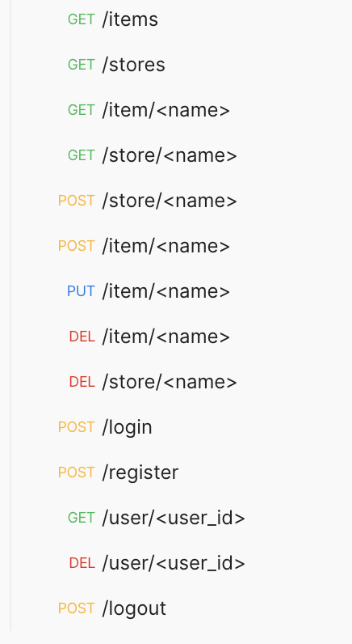

# stores-restapi

A simple store ready-to-use application that utilizes REST APIs with Python, Flask, Flask-RESTful, and Flask-SQLAlchemy

## Description

Production-ready REST APIs with Flask
- Using Flask and popular extensions, stores-api is developed with production-ready REST APIs.
- Using the JWT extension, app is able to have users' login/logout function with different access levels.
- App is deployed on Heroku, can be deployed.
- Following rest points are implemented:

### Dependencies
- Flask
- Flask-JWT
- Flask-JWT-Extended
- Flask-RESTful
- Flask-SQLAlchemy
- Werkzeug

## Authors

Heetae Yang